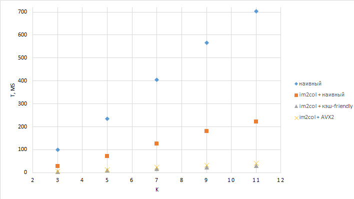

## Наивная свёртка
Алгоритм данной свёртки — расчёт по определению. То есть для каждого "окна", полученного с помощью перемещения ядра по тензору, находим сумму произведений "пикселей" на соответствующие веса.
Недостатком такого метода является очень низкая локальность обращения к данным, то есть очень частые cache misses.

## im2col
Данный алгоритм как раз исправляет недостаток наивной свёртки: мы составляем 2 матрицы по данным, которые у нас есть. Сначала мы берём 1-е окно 1-го батча, которое у нас получается с помощью наложения ядра на тензор входных данных. Далее разворачиваем получившееся окно в столбец и записываем в матрицу, затем берём следующее окно и повторяем — так продолжаем делать по всем каналам. Затем переходим ко второму батчу и заполняем матрицу уже по новой строке. Так продолжается до создания полной IFMap-матрицы. Также нужно составить матрицу фильтров: для этого разворачиваем каждый фильтр в столбец и составляем из этих столбцов матрицу. На рисунке ниже представлена схема im2col из статьи [Fast Algorithms for Convolutional Neural Networks](https://arxiv.org/pdf/1904.01691). (Таким образом вместо 6-7 вложенных циклов мы получили перемножение матриц)


Дальше с помощью GEMM получаем выходную матрицу.
Недостатками данного метода являются: излишнее использование памяти (одни и те же поля используются несколько раз), затраты на преобразование данных. Решение данных проблем было описано в статье [Optimizations for Convolutional Neural Networks](https://arxiv.org/pdf/2110.03901).

## Общая информация по проекту
В данной задаче были реализованы два вышеописанных метода, а также 3 разных GEMM: наивный, кэш-friendly и использующий AVX2 (интринсики). С помощью Google Benchmark были проведены измерения времени работы разных алгоритмов для входных размеров ядра K = 3×3, 5×5, 7×7, 9×9, 11×11.

## Результаты бенчмарка


Входной тензор: `[2, 32, 32, 32]`, выходные каналы: `64`. Замеры выполнены на 16-ядерном процессоре 2.3 ГГц.

| Метод | K=3 | K=5 | K=7 | K=9 | K=11 |
|-------|-----|-----|-----|-----|------|
| conv_naive | 99.3 ms | 235 ms | 404 ms | 565 ms | 701 ms |
| im2col + GEMM_NAIVE | 28.2 ms | 71.8 ms | 125 ms | 180 ms | 221 ms |
| im2col + GEMM_CACHE | **4.28 ms** | **9.87 ms** | **16.2 ms** | **23.3 ms** | **29.2 ms** |
| im2col + GEMM_AVX2 | 5.66 ms | 13.2 ms | 22.4 ms | 31.6 ms | 39.7 ms |

**Наблюдения:**
**Наблюдения:**
- Зависимость времени от `K` визуально напоминает корень на отрезке `K=7..11`, хотя теоретическая сложность содержит `K^2`. 
- `im2col` даёт ускорение **3.5×–24×** по сравнению с наивной реализацией.
- На данных среднего размера `CACHE_FRIENDLY` показывает лучший результат.
## Сборка и запуск
Проект использует `CMake` и автоматически загружает зависимости (`Catch2`, `Google Benchmark`) через `FetchContent`.

```bash
# 1. Создание папки сборки и конфигурация
mkdir build && cd build
cmake ..

# 2. Компиляция 
make -j$(nproc)

# 3. Запуск
./conv_compare          # Интерактивное сравнение 4 алгоритмов
./test_conv             # Модульные тесты корректности
./bench_conv            # Бенчмарки производительности
./bench_conv --benchmark_format=csv > results.csv  # Экспорт в CSV